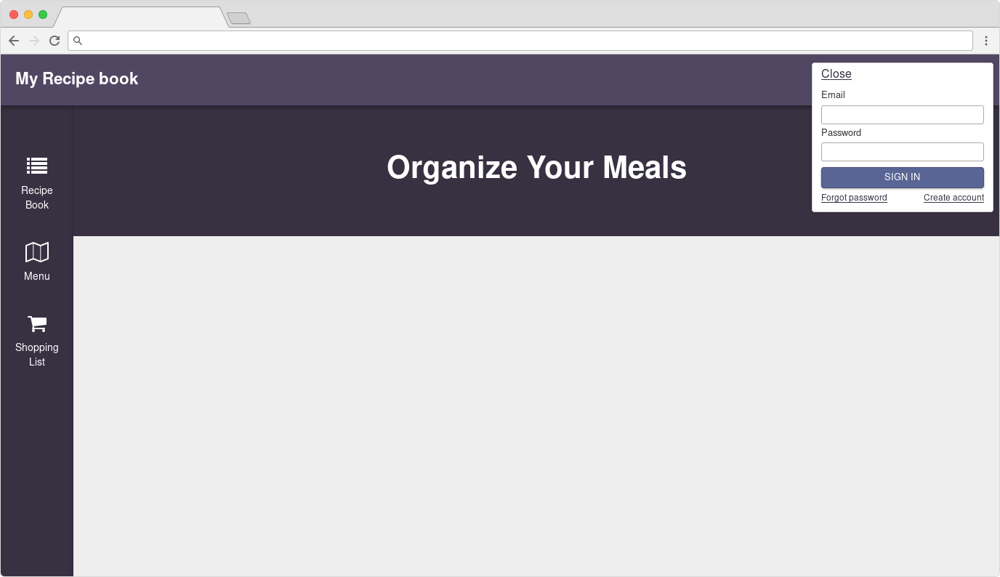
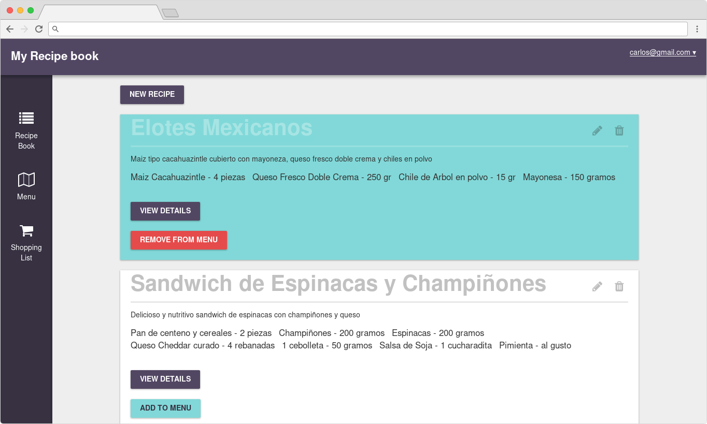
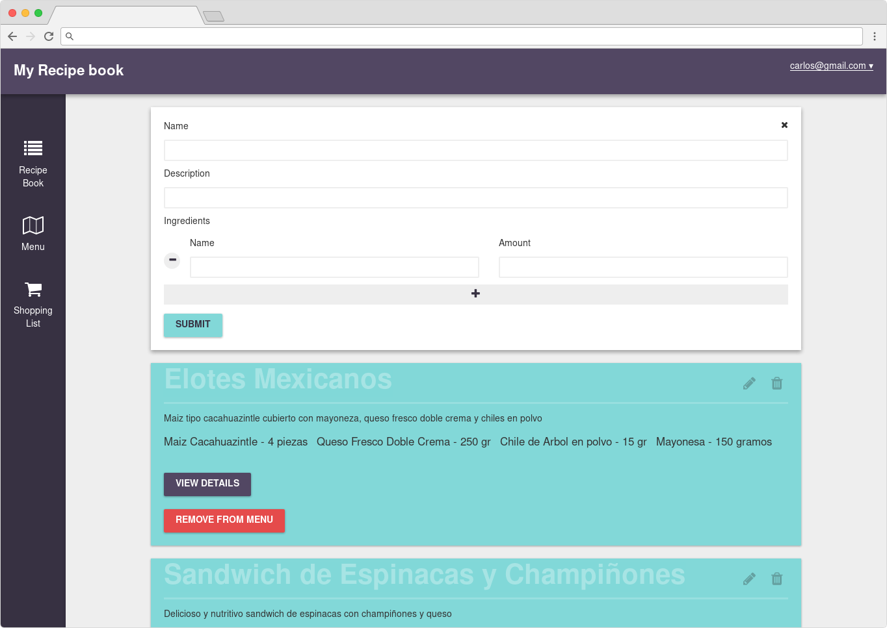
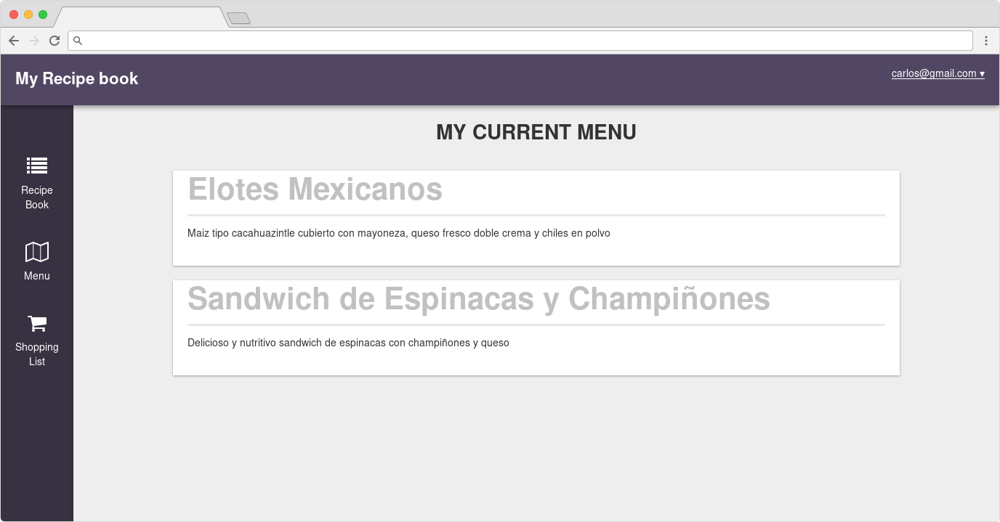
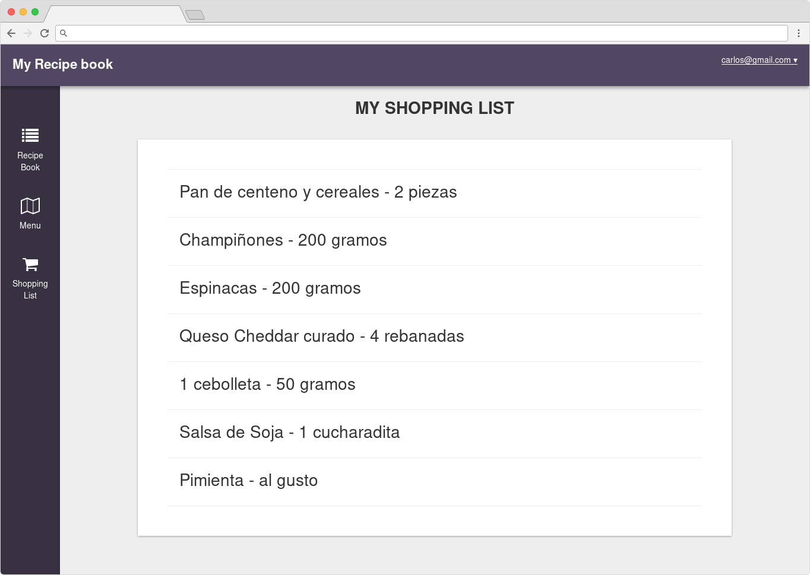

# Recipe Book App

Install:

1. git clone git@github.com:carlosgomez2/recipe-book.git
2. cd into directory
3. run `meteor` to install all dependencies
4. browse to localhost:3000
5. create an account and enjoy the app

Screenshots:

Troubleshooting:

- If `Error: EISDIR: illegal operation on a directory, unlink ... dev_bundle`? Go to app directory, show hidden files, go to .meteor/local erase dev_bundle folders. rebuild app with `meteor`.
